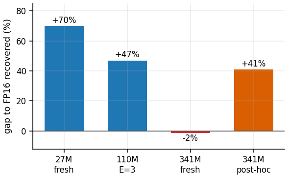

<div align="center">

# Echo-1.58

### Native Ternary (1.58-bit) Masked-Diffusion Language Models

Training language models with every weight held to `{-1, 0, +1}`, measured against
parameter-matched full-precision twins.

[](LICENSE)
[](#released-checkpoints)
[](https://huggingface.co/collections/lupodevelop/echo-158-ternary-masked-diffusion-lms-6a5dd179a5f7ad08cc277404)
[](https://doi.org/10.5281/zenodo.21455055)

**Paper** ([Zenodo, DOI 10.5281/zenodo.21455055](https://doi.org/10.5281/zenodo.21455055); arXiv pending) · **[Models](https://huggingface.co/collections/lupodevelop/echo-158-ternary-masked-diffusion-lms-6a5dd179a5f7ad08cc277404)** · **[Full results](results/RESULTS.md)**

</div>

---

## TL;DR

Quantize a trained masked-diffusion LM to ternary weights and it dies: perplexity explodes by
more than an order of magnitude, and calibration does not save it. Training natively at 1.58
bits survives, at a penalty. This work measures what that penalty is and, mainly, **what buys
it back**. Each ternary model is trained alongside a full-precision twin on the same tokens,
in the same order, under the same masks, so the gap between the two is the price of precision
and nothing else.

The central result is a predictive rule: only interventions that **add** information or
parameters to the run recover the gap; interventions that merely **reorganize** training do
not.

<div align="center">

</div>

## Key findings

| | Finding |
|---|---|
| **Only additions recover the penalty** | Distillation from the twin + a per-channel scale (0.07% of memory) recover 70% of the gap at 27M. Interventions that only reorganize training recover nothing. The additive/redistributive split is registered a priori and used predictively. |
| **Recovery is scale- and mode-dependent** | At 341M the recipe recovers 41-49% applied *post-hoc*, and nothing from step 0. Post-hoc distillation scales; from-scratch does not (single 341M run). |
| **PTQ collapses at 1.58 bit** | Round-to-nearest costs 26x perplexity; calibrated GPTQ still 4.7x. Native QAT costs a few percent. This is what makes native training worth doing. |
| **The penalty is a near-constant offset** | About 0.19 nats/token in our 27M-341M undertrained regime, fresh or repeated tokens. An empirical regularity, not a fitted law; it does not claim to hold at billion-parameter scale (cf. Spectra). |
| **Memory, not latency** | A 5.4x smaller model for a bounded 6-11% cost. Without a memory constraint, train FP16. |

Three pre-registered technique predictions went zero for three; we report them, along with a
replicated free win (per-epoch learning-rate re-warming) that emerged from the failures.

## Results at a glance (341M, common protocol)

| Model | perplexity | vs FP16 twin | recovery |
|---|---|---|---|
| FP16 twin | 122.7 | ceiling | |
| Ternary baseline | 146.2 | +19.2% | |
| + continued distillation (post-hoc) | 136.0 | +10.8% | **41%** (48-49% on test / out-of-domain) |
| + from-scratch recipe | 146.6 | +19.5% | ~0 (null: the recipe from step 0 does not scale) |

Full tables with sources in [`results/RESULTS.md`](results/RESULTS.md).

## Released checkpoints

Four 341M models (bare ternary, FP16 twin, continued-distilled, and the from-scratch **null
control**) plus the 27M research ladder, all bfloat16 and verified to reproduce the
full-precision evaluation within 0.0003 masked-CE. See the
[Hugging Face collection](https://huggingface.co/collections/lupodevelop/echo-158-ternary-masked-diffusion-lms-6a5dd179a5f7ad08cc277404).

> **These are research artifacts, not production models.** At roughly 12 tokens per parameter
> neither the ternary nor the full-precision model composes fluent text. Use them for
> reproduction, infilling analysis, and as paired baselines.

## Reproducing the results

Everything runs as a module from the repository root.

```bash
pip install -r requirements.txt

python -m eval.verify                                    # quantizer sanity checks (no GPU)
python -m train.diffusion                                # sampler self-check
python -m eval.ptq --help                                # PTQ collapse vs native QAT
python -m eval.cloze --ckpt <ckpt> --tokenizer spm_it.model   # infilling accuracy
python -m eval.sample --ckpt <ckpt> --tokenizer spm_it.model  # loop-free generation
```

The 27M ablation is roughly one GPU-day on an RTX 3090; the 341M runs a few days each on an
L40S. See [`results/RESULTS.md`](results/RESULTS.md) for every number and its raw source.

## Repository layout

- **`model/`** architecture and quantizer (`arch.py`, `quant.py`, `mitigations.py`,
  `model_ar.py`, `muon.py`, `configs.py`).
- **`train/`** the masked-diffusion loss, samplers, and training loops (`diffusion.py`,
  `train_diffusion.py`, `train_ar.py`, `train_muon.py`).
- **`eval/`** verification and analysis (`verify.py`, `ptq.py`, `cloze.py`, `sample.py`,
  `analyze.py`, `ar_gap.py`).
- **`results/`** every table behind the paper. **`paper/`** the PDF.

## Citation

```bibtex
@article{scaratti2026ternary,
  author  = {Daniele Scaratti},
  title   = {Recovering the Ternary Penalty in Masked Diffusion Language Models: What Adds Capacity, What Only Reorganizes, and What Repetition Costs},
  journal = {arXiv preprint},
  year    = {2026},
  doi     = {10.5281/zenodo.21455055}
}
```

## License

Code under the [MIT License](LICENSE); model weights under Apache 2.0.
